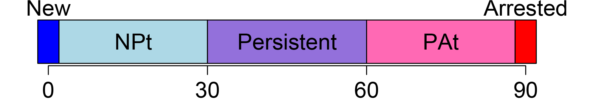

# TockyLocus: Quantitative Analysis Methods for Flow Cytometric Fluorescent Timer Data


<a href="https://monotockylab.github.io/TockyLocus/">


</a>


**Author:** Dr. Masahiro Ono  
**Date:** 14 November 2024

## Introduction: Fluorescent Timer as Experimental Tool and Development of the Tocky Concept

### The potential of Fluorescent Timer proteins 
Fluorescent Timer proteins uniquely alter their emission spectra over time, making them powerful tools for monitoring dynamic cellular processes. These proteins are pivotal for understanding the intricate temporal dynamics of cellular events. Despite their potential, analyzing Timer fluorescence data in flow cytometry is often hampered by variability in instrument settings and the lack of standardized data preprocessing methods.

### Tocky: A Breakthrough in Fluorescent Timer Analysis

A significant advancement was made in 2018 when the Ono lab introduced **Tocky**, a novel concept for analyzing Fluorescent Timer data. This approach encompasses data normalization and transformation methods (see [Introduction](https://monotockylab.github.io/TockyPrep/articles/Introduction.html)). However, a computational implementation of this methodology was not yet available.

The breakthrough in the anslysis of Fluorescent Timer data was the introduction of the polar coordinate, or trigonometric transformation of Timer fluorescence data, which produces the key variables: *Timer Angle* and *Timer Intensity*.


However, to effectively use the approach, a dedicated computational tool was required to normalize and transform Timer fluorescence data. To address these challenges, we have recently developed the [**TockyPrep**](https://monotockylab.github.io/TockyPrep/) package. This R package provides a comprehensive suite of tools designed to automate the preprocessing, normalization, and trigonometric transformation of Timer fluorescence data. **TockyPrep** specifically addresses the normalization of immature and mature Timer fluorescence as a critical step for robust downstream analysis.


## TockyLocus: The R Package for Quantitative Analysis of Fluorescent Timer Data


### Aim of the TockyLocus Package

The aim of the **TockyLocus** package is to standardize quantitative analysis and visualization techniques for flow cytometric Fluorescent Timer data. It focuses on data categorization using Timer Angle data, which represents the temporal maturation dynamics of Timer proteins.


### Features of the TockyLocus Package

**Timer Data Categorization Method**: 

- This feature enables quantitative analysis and effective visualization of Timer fluorescence dynamics. Precisely, Timer Angle data is categorized into the five loci. This allows quantitative analysis of cell dynamics across Timer loci, enabling effective visualization and statistical analysis.
   



**Visualization Tools**: 

- The package includes functions to visualize Tocky Locus.

**Statistical Analysis Methods**:

- Dedicated statistical methods are implemented for group-wise comparison of Tocky Locus data.


#### Availability

- **TockyLocus** is freely available for distribution via GitHub:

Link to the repository: [TockyLocus on GitHub](https://github.com/MonoTockyLab/TockyLocus)

## Getting Started with TockyLocus

To begin using **TockyLocus**, install the package from GitHub using the following command:

```R
# Install TockyLocus from GitHub
devtools::install_github("MonoTockyLab/TockyLocus")
```

## 4. Package Documentation

The **TockyLocus** package documentation is available online:

- **Website**: [https://MonoTockyLab.github.io/TockyLocus/](https://MonoTockyLab.github.io/TockyLocus/)

This site includes all the function reference manuals and vignettes (tutorials).

In addition to the HTML manual pages, a PDF manual for the **TockyLocus** package is available. You can find it in the installed package directory under `doc/`, or you can access it directly from [GitHub](https://github.com/MonoTockyLab/TockyLocus/blob/main/inst/doc/TockyLocus_0.1.0.pdf).

<br>

## 5. Copyright, License, and Citation Guidelines

### Copyright

All code and original graphical content within the TockyPrep package, including anime-like characters and logos, are copyrighted by [Masahiro Ono](https://monotockylab.github.io/). 

### License

The distribution and modification are governed by the Apache License 2.0, which ensures that all users have the freedom to use and change the software in a way that respects the original authorship. See the [LICENSE](https://github.com/MonoTockyLab/TockyLocus/blob/main/LICENSE) file for more information.

### Citing TockyLocus

If you use **TockyLocus** in your research, please cite:

Masahiro Ono (2024). *TockyLocus: Quantitative Analysis Methods for Flow Cytometric Fluorescent Timer Data.* arXiv:2411.04111 [q-bio.QM]. Available at:[https://arxiv.org/abs/2411.04111](https://arxiv.org/abs/2411.04111).

#### BibTeX Entry

```bibtex
@article{ono2024TockyLocus,
    title={TockyLocus: Quantitative Analysis Methods for Flow Cytometric Fluorescent Timer Data},
    author={Masahiro Ono},
    year={2024},
    journal={arXiv:2411.04111 [q-bio.QM]},
    url={https://arxiv.org/abs/2411.04111},
}
```

#### Why Citation Is Important

Citing software you've used is crucial for acknowledging contributions and ensuring reproducibility, which are critical for scientific progress.

- Giving credit to the developers and researchers who have contributed to the tools you utilize respects and acknowledges their intellectual contributions.
- Proper citations allow other researchers to access the same tools and versions, thus replicating and verifying your scientific results.

Citations are integral to the scientific ecosystem; they help trace the evolution of ideas and enable others to build upon existing research.

We kindly remind our users that **citing software is as important as citing academic articles in maintaining the integrity of the scientific record.**

#### Further Resources

For additional guidance on citation practices and maintaining research integrity, we recommend visiting the [Committee on Publication Ethics (COPE)](https://publicationethics.org/), which offers valuable resources and support for adhering to ethical practices in scholarly publishing.

## 6. The Ono Lab (MonoTockyLab)


**The Masahiro Ono Lab (MonoTockyLab)** offers innovative approaches to analyzing omics and flow cytometric data. The lab is particularly well-known for their development of Timer-of-cell-kinetics-and-Activity (**Tocky**) and integrated analysis of immunological data using both experiments and computational analysis.

**Principal Investigator**: Dr. Masahiro Ono, Reader in Immunology at Imperial College London.

Dr. Ono is **the creator and developer of Tocky**. He innovated the transgenic and computational technologies that constitute Tocky.

In 2008, Dr. Ono initiated his pioneering transition from molecular immunology to becoming an **Integrated Experimental and Computational Immunologist**, demonstrating his visionary leadership and pioneering spirit in the development and application of multidimensional analysis and computational methods to address experimental and immunological problems. Tocky represents one of the fusion technologies that Dr. Ono has both created and developed.

Tocky employs the Fluorescent Timer protein to analyze the temporal dynamics of cell activities and development *in vivo*. His lab integrates molecular biology, immunology, and computational analysis to develop novel research tools, thereby enhancing the understanding of immune cell biology.

## 7. Contact and More


**Email**: 
<a href="mailto:m.ono@imperial.ac.uk">
  

</a>


**Personal Homepage**:
<a href="http://monotockylab.github.io">
  
</a>

**GitHub**:
<a href="https://github.com/MonoTockyLab">
  
</a>

**Twitter**:
<a href="https://twitter.com/MonoTockyLab">
  
</a>

**Professional Homepage**: [Imperial College London - Masahiro Ono](https://www.imperial.ac.uk/people/m.ono)


