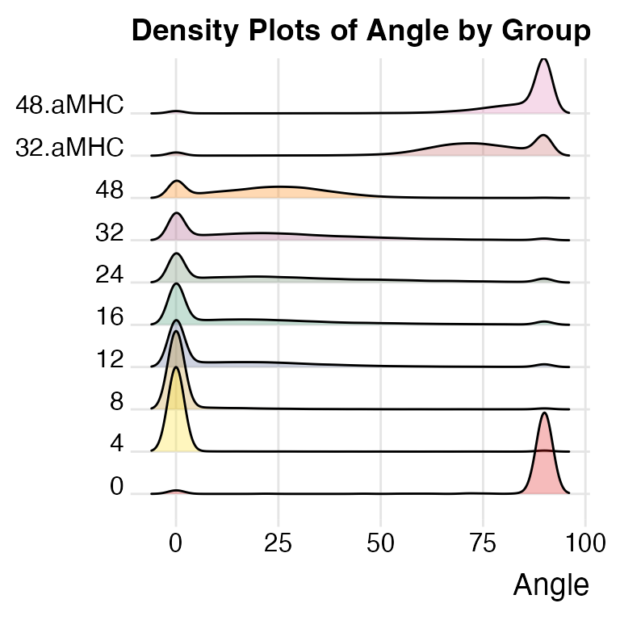
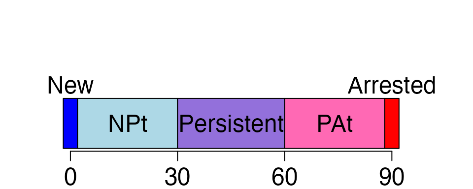
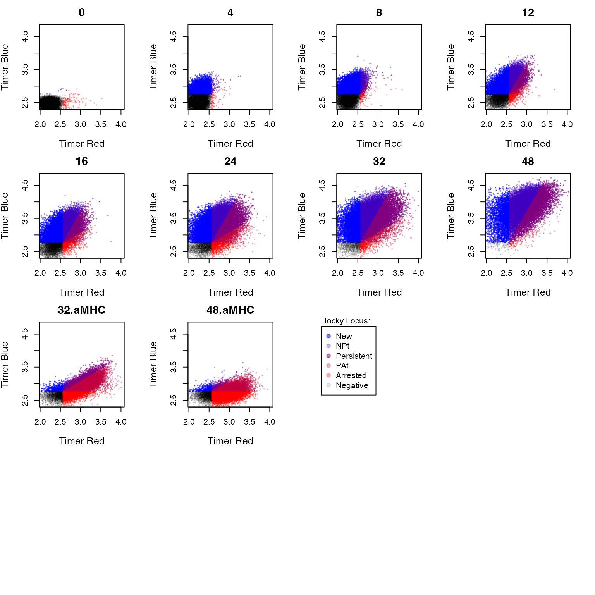
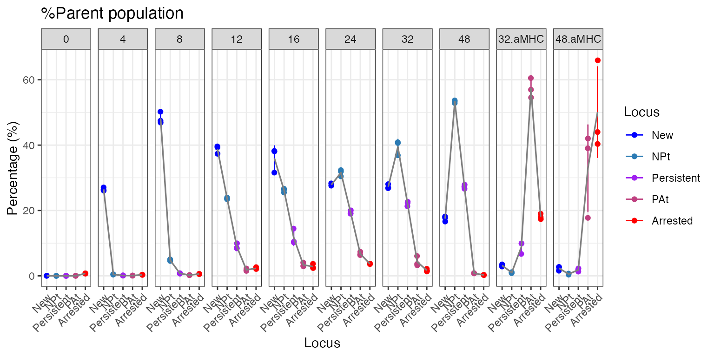
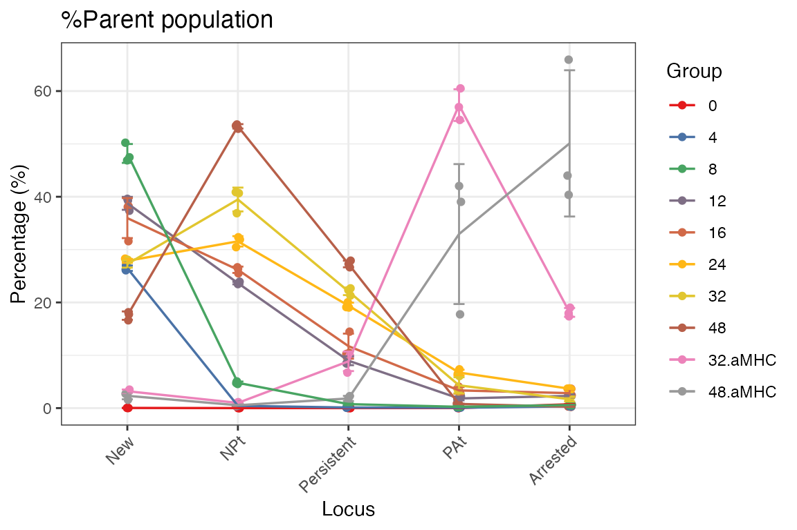
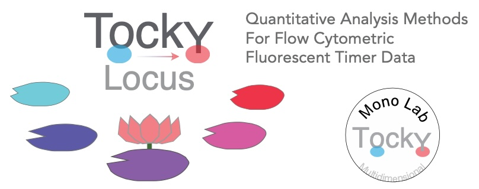

# Introduction to Tocky Locus Analysis


## Introduction

Fluorescent Timer proteins uniquely change their emission spectra over
time and serve as powerful tools for monitoring the dynamic processes
within cells. Our recent efforts have successfully implemented data
preprocessing methods in the **TockyPrep** package. However, it is still
challenging to analyze Timer fluorescence dynamics and apply
quantitative and statistical analysis methods. To overcome these
challenges, the **TockyLocus** package has been developed. This R
package provides quantitative analysis methods, statistical methods, and
visualization techniques dedicated for Timer fluorescence data analysis.

### Aim

The aim of the **TockyLocus** package is to standardize quantitative
analysis and visualization techniques for flow cytometric Fluorescent
Timer data. It focuses on data categorization using Timer Angle data,
which represents the temporal maturation dynamics of Timer proteins.

### Relationship to the package TockyPrep

The **TockyPrep** package facilitates data preprocessing for flow
cytometric Fluorescent Timer data. The **TockyLocus** package utilizes
this preprocessed data to apply its advanced quantitative and
visualization methods.

### Getting Started with **TockyLocus**

To begin using **TockyLocus**, install both TockyLocus and TockyPrep
packages from GitHub:

``` r
# Install TockyPrep and TockyLocus from GitHub
devtools::install_github("MonoTockyLab/TockyPrep")
devtools::install_github("MonoTockyLab/TockyLocus")
```

## Sample Workflow

This section guides you through a typical analysis workflow using
**TockyLocus** to process flow cytometric data of cells expressing
Fluorescent Timer proteins, covering data import, preprocessing
application, and basic visualization techniques.

### Data Preprocessing Using **TockyPrep**

First, load the necessary packages.

``` r
library(TockyPrep)
library(TockyLocus)
```

Load example data included in the TockyLocus package as follows:

``` r
# Example data load
# Define the base path
file_path <- system.file("extdata", package = "TockyLocus")

# Define files
negfile <- "Timer_negative.csv"
samplefiles <- list.files(file_path, pattern = "sample_", full.names = FALSE)
samplefiles <- setdiff(samplefiles, file.path(file_path, negfile))
```

The dataset was derived from Nr4a3 Tocky T-cells. Briefly, T-cells from
Nr4a3 Tocky T cells were activated by antigen stimulation using the ova/
OT-II system, and time course analysis was performed (Bending et al.
([2018](#ref-Bending2018JCB))).

| Group   | Time (h) | Treatment                      |
|---------|----------|--------------------------------|
| 0       | 0        | Stimulation from 0h            |
| 4       | 4        | Stimulation from 0h            |
| 8       | 8        | Stimulation from 0h            |
| 12      | 12       | Stimulation from 0h            |
| 16      | 16       | Stimulation from 0h            |
| 24      | 24       | Stimulation from 0h            |
| 32      | 32       | Stimulation from 0h            |
| 48      | 48       | Stimulation from 0h            |
| 32.aMHC | 32       | Stim. till 24h, then suspended |
| 48.aMHC | 48       | Stim. till 24h, then suspended |

#### Execute data preprocessing using **TockyPrep**:


Define sample and negative control files using the `prep_tocky` function

``` r
# Preprocessing data
prep <- prep_tocky(path = file_path, samplefile = samplefiles, negfile = negfile, interactive = FALSE)
```

The function `timer_transform` not only imports data but also normalize
and transform Timer blue and red fluorescence data.

``` r
# Normalizing and transforming data
x <- timer_transform(prep, blue_channel = 'Timer.Blue', red_channel = 'Timer.Red', select = FALSE, verbose = FALSE)
```

Check the class of the transformed object:

``` r
class(x)
```

    ## [1] "TockyPrepData"
    ## attr(,"package")
    ## [1] "TockyPrep"

To effectively visualize the processed data, define sample grouping
using the function `sample_definition`.

The example file `sampledefinition.csv` provides the standard form. Use
read.csv to create a data.frame onject, which can be used as input into
`sample_definition`.

``` r
sample_definition <- read.csv(file.path(file_path, 'sampledef.csv'))
sample_definition <- as.data.frame(sample_definition)
head(sample_definition)
```

    ##                 file group
    ## 1 sample_0hrs_R1.csv     0
    ## 2 sample_0hrs_R2.csv     0
    ## 3 sample_0hrs_R3.csv     0
    ## 4 sample_4hrs_R1.csv     4
    ## 5 sample_4hrs_R2.csv     4
    ## 6 sample_4hrs_R3.csv     4

``` r
# Normalizing and transforming data

x <- sample_definition(x, sample_definition = sample_definition, interactive = FALSE)
```

Alternatively, define sample grouping for effective visualization by
using the `sample_definition` function with the `interactive = TRUE`
option. This approach will generate a CSV file in your working
directory. You should edit this CSV file to include sample grouping
information in the `group` column. After editing, follow the prompts in
the interactive session and press `RETURN` upon completion.

Visualize the processed data with a density plot using the function
`plotAngleDensity`.

``` r
# Visualizing the results
plotAngleDensity(x)
```

    ## Picking joint bandwidth of 2



The `plotAngleDensity` function offers preliminary insights into the
dynamics of Timer fluorescence. However, this visualization method has
certain limitations that will be discussed in subsequent sections.

### Tocky Locus Analysis

Use the `TockyLocus` function to apply the Tocky Locus approach to your
data:

``` r
x <- TockyLocus(x)
```

The `TockyLocus` function categorizes Timer Angle data into five
categories. To visually represent these categories, the
`plotTockyLocusLegend` function can be used to produce a schematic
figure of the five Tocky Locus categories.

``` r
plotTockyLocusLegend(mar_par = c(2, 2, 4, 2))
```



For quality checks of the Tocky Locus categorization, use the
`plot_tocky_locus` function. The option `n = 4` specifies the number of
columns in the multi-panel plot.

### plot_tocky_locus: The QC plot for TockyLocus

``` r
plot_tocky_locus(x, n = 4)
```

    ## ..



Note that the sample at 0 hours, taken before antigen stimulation, shows
some pure red fluorescence. This phenomenon is due to the memory
phenotype T-cells accumulated in vivo in OT-II Nr4a3 Tocky mice. These
memory phenotype T-cells are considered self-reactive and can develop in
OT-II Nr4a3 Tocky mice as the Rag genes are sufficiently expressed (Ono
and Satou ([2024](#ref-OnoSatou2024))).

### plotTockyLocus: The Plot Function for TockyLocus

To visualize the Timer Angle dynamics per Tocky Locus, use the
`plotTockyLocus` function. The default ‘faceted’ plot produces multiple
panels for different groups. Note that the percentage data are based on
the percentages within the parent population, which in this dataset, is
CD4+ T cells.

``` r
plotTockyLocus(x, verbose = FALSE)
```



If you prefer not to use faceting, employ the `group_by = FALSE` option
to generate a Tocky Locus plot without multiple panels.

``` r
plotTockyLocus(x, group_by = FALSE,  verbose = FALSE)
```



### Further Reading

Your data is now ready for statistical testing and downstream analysis.
For more information and detailed methodology, refer to our paper:

Masahiro Ono (2024). *TockyLocus: Quantitative Analysis Methods for Flow
Cytometric Fluorescent Timer Data.* arXiv:2411.09386 \[q-bio.QM\].
Available at:<https://arxiv.org/abs/2411.09386>.



## References:

Bending, David, Paz Prieto Martı́n, Alina Paduraru, Catherine Ducker,
Erik Marzaganov, Marie Laviron, Satsuki Kitano, Hitoshi Miyachi, Tessa
Crompton, and Masahiro Ono. 2018. “A Timer for Analyzing Temporally
Dynamic Changes in Transcription During Differentiation in Vivo.”
*Journal of Cell Biology* 217 (8): 2931–50.
<https://rupress.org/jcb/article/217/8/2931/39442/A-timer-for-analyzing-temporally-dynamic-changes>.

Ono, Masahiro, and Yorifumi Satou. 2024. “Spectrum of Treg and
Self-Reactive t Cells: Single Cell Perspectives from Old Friend HTLV-1.”
*Discovery Immunology* 3 (1): kyae006.
<https://doi.org/10.1093/discim/kyae006>.
